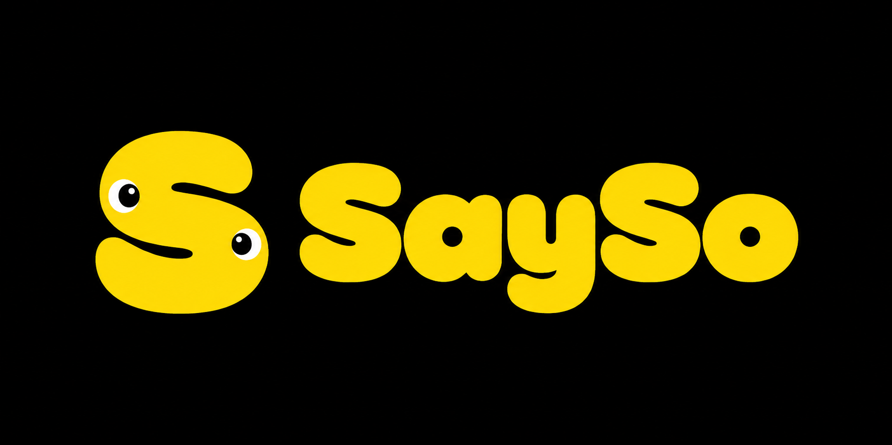

<p align="center">
  
</p>

<p align="center">
  <b>The website for SaySo</b><br>
  A free, unlimited, open source speech-to-text app that works completely offline.
</p>

<p align="center">
  <a href="https://github.com/AaryanRaj007/SaySo">App source</a> ·
  <a href="public/SaySo_0.9.4_aarch64.dmg">Download for macOS</a> ·
  <a href="#local-development">Development</a>
</p>

---

## What's here

This repo holds the marketing site and documentation for SaySo, plus the macOS
build that the download page serves.

- **Site** — [Astro](https://astro.build) with Tailwind CSS, static output
- **Docs** — MDX under `src/content/docs/`, rendered at `/docs`
- **Download** — `public/SaySo_<version>_aarch64.dmg` is served directly by the
  site, so the download button works without needing a GitHub release

The app itself lives in a separate repo: **[AaryanRaj007/SaySo](https://github.com/AaryanRaj007/SaySo)**.

## Supported platforms

| Platform | Status |
| :-- | :-- |
| macOS (Apple Silicon) | Available |
| Windows x64 | Coming soon |
| Intel Mac, Linux | Build from source |

SaySo isn't signed with a paid Apple or Microsoft certificate, so the first
launch shows a security warning. The [download page](src/pages/download.astro)
walks users through it, and the Homebrew route avoids it entirely.

## Local development

```bash
npm install
npm run dev      # http://localhost:4321
```

| Command | Action |
| :-- | :-- |
| `npm install` | Install dependencies |
| `npm run dev` | Dev server at `localhost:4321` |
| `npm run build` | Build to `./dist/` |
| `npm run preview` | Preview the production build |

## Project layout

```
public/
  SaySo_0.9.4_aarch64.dmg   the macOS build the site serves
  brand/                    logo and banner
  docs/                     screenshots used in the docs
src/
  components/ui/            navbar (shadcn-style, Radix primitives)
  config/site.ts            repo + release URLs, edit these first
  config/downloads.ts       download links and platform detection
  content/docs/             documentation pages (MDX)
  pages/                    index, download, about, docs
  styles/global.css         brand palette and typography
```

## Configuration

Two files cover almost everything:

- **`src/config/site.ts`** — GitHub owner/repo and release URLs. The header
  link, download links and docs support links all derive from these.
- **`src/config/downloads.ts`** — version number, download paths, and
  `WINDOWS_AVAILABLE`. Flip that flag to `true` once a Windows installer exists
  and the "coming soon" notice becomes real download buttons.

Update `site` in `astro.config.mjs` to match wherever this is deployed.

## Releasing a new version

1. Build the app in the [app repo](https://github.com/AaryanRaj007/SaySo):
   `npm run tauri build && ./scripts/install-macos.sh`
2. Copy the new `.dmg` into `public/`
3. Bump `VERSION` in `src/config/downloads.ts`
4. Delete the old `.dmg` and commit

## Brand

The SaySo mark and wordmark live in `public/brand/`. The palette is brand yellow
`#ffe000` on a warm cream `#fffbe8`, with Bagel Fat One for the wordmark and
large headings and Fredoka for everything else.

Yellow is used for fills only. As text on cream it fails contrast, so accented
text uses a darker gold (`#8a6d00`) instead.

## Credits

SaySo is a fork of [Handy](https://github.com/cjpais/Handy) by CJ Pais, MIT
licensed. This site is derived from
[handy.computer](https://github.com/cjpais/handy.computer).

The Handy name, logo and brand assets are not covered by that license and are
not used here. Likewise the SaySo name and brand belong to altn.

## License

[MIT](LICENSE)
